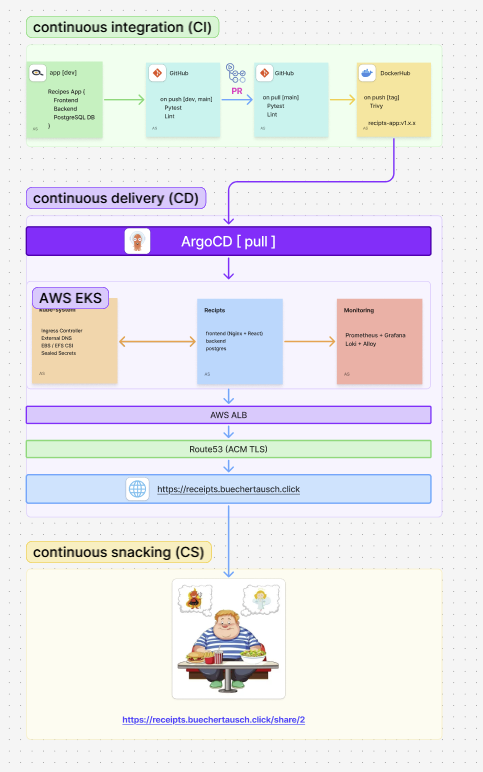

# gitops-multicloud-aks-eks-receipt-app

Multi-cloud GitOps infrastructure for deploying a fullstack receipt management application on AWS EKS (Azure AKS — planned).

**Live**: https://receipts.buechertausch.click

## CI/CD Architecture



## Stack

| Tool | Role |
|---|---|
| **Terraform** | Provisions VPC, subnets, IAM, EKS cluster, addons, ACM certs, Ingresses |
| **ArgoCD** | GitOps CD — App of Apps pattern, sync-wave ordering |
| **Sealed Secrets** | Encrypts Kubernetes secrets for safe Git storage |
| **AWS LB Controller** | Creates ALB/NLB from Kubernetes Ingress resources |
| **ExternalDNS** | Manages Route53 DNS records from Ingress annotations |
| **EBS CSI Driver** | Dynamic EBS volume provisioning (gp3 StorageClass) |
| **EFS CSI Driver** | Shared ReadWriteMany volume for recipe media files |
| **cert-manager** | TLS certificates via Let's Encrypt (DNS-01 / Route53) |
| **kube-prometheus-stack** | Prometheus + Grafana + Alertmanager |
| **Loki + Alloy** | Log aggregation — Alloy collects, Loki stores |

## Repository structure

```
app/                              # GitOps manifests (ArgoCD watches this)
├── apps/
│   ├── application.yaml          # Root App of Apps — apply once manually
│   ├── sealed-secrets.yaml       # wave 1
│   ├── storage.yaml              # wave 1 — gp3 StorageClass
│   ├── cert-manager.yaml         # wave 2
│   ├── loki.yaml                 # wave 2
│   ├── monitoring.yaml           # wave 2 — kube-prometheus-stack
│   ├── alloy.yaml                # wave 3
│   ├── cert-manager-config.yaml  # wave 3 — ClusterIssuer
│   ├── monitoring-config.yaml    # wave 3 — Grafana SealedSecret
│   └── receipts.yaml             # wave 4
├── receipts/
│   ├── namespace.yaml
│   ├── backend/                  # Django, port 9000
│   ├── frontend/                 # Nginx + React, port 80
│   ├── postgres/                 # StatefulSet + headless Service, PVC 5Gi gp3
│   └── sealed-secrets/           # db-credentials + app-secret (kubeseal encrypted)
├── cert-manager/
│   └── cluster-issuer.yml        # Let's Encrypt production
├── monitoring/
│   └── grafana-sealed-secret.yaml
└── storage/
    └── gp3-storageclass.yaml

infra/
└── live/
    └── aws/
        ├── bootstrap/            # S3 backend + DynamoDB lock (apply once)
        └── dev/
            ├── dev.tfvars        # shared variables for all dev layers
            ├── aws-network/      # VPC, subnets, IGW, NAT GW, route tables
            ├── aws-iam/          # EKS cluster role + node group role
            ├── aws-eks/          # EKS cluster + node group + OIDC provider
            └── aws-addons/       # LB Controller, ExternalDNS, EBS CSI, cert-manager,
                                  # ArgoCD, ACM certs, Ingresses (receipts + grafana)
```

## Cloud targets

| Cloud | Cluster | Region | Status |
|---|---|---|---|
| AWS | EKS 1.32 | eu-north-1 | ✅ deployed |
| Azure | AKS | — | 📋 planned |

## Infrastructure layers (AWS dev)

### 1. bootstrap
Creates S3 bucket for Terraform remote state and DynamoDB table for state locking. Apply once per account.

### 2. aws-network
- VPC `10.0.0.0/16`
- 2 public subnets (eu-north-1a/b) — tagged `kubernetes.io/role/elb`
- 2 private subnets (eu-north-1a/b) — tagged `kubernetes.io/role/internal-elb`
- Internet Gateway, NAT Gateway, route tables

### 3. aws-iam
- `ascom-receipts-eks-cluster-role` — EKS control plane
- `ascom-receipts-eks-node-group-role` — worker nodes

### 4. aws-eks
- EKS 1.32, private + public endpoint
- Managed node group in private subnets (`t3.small`, Ubuntu 22.04, gp3 20 GiB)
- OIDC provider for IRSA
- Outputs: `oidc_provider_arn`, `oidc_issuer_url` (consumed by aws-addons)

### 5. aws-addons
IRSA roles for all addon service accounts (no static credentials):

| Addon | IRSA Role | Permissions |
|---|---|---|
| AWS LB Controller | `*-lb-controller-role` | EC2, ELBv2 |
| ExternalDNS | `*-external-dns-role` | Route53 record management |
| EBS CSI Driver | `*-ebs-csi-role` | EC2 EBS volumes |
| EFS CSI Driver | `*-efs-csi-role` | Amazon EFS |
| cert-manager | `*-cert-manager-role` | Route53 DNS-01 challenge |

Also provisions:
- ACM certificates for `receipts.buechertausch.click` and `grafana.receipts.buechertausch.click` with automatic Route53 DNS validation
- Kubernetes Ingresses for receipts-app and Grafana (managed here so ACM ARNs never appear in Git)
- Namespace `receipts` (must exist before the Ingress resource is applied)
- EFS filesystem + mount targets + `efs-sc` StorageClass + `media-pvc` PVC (`ReadWriteMany`, shared between backend and frontend pods)
- Helm: aws-lb-controller, external-dns, ArgoCD

## Application deployment (ArgoCD App of Apps)

### Prerequisites
- Terraform layers 1–5 applied
- `kubectl` configured
- `kubeseal` CLI installed

### Push manifests and bootstrap ArgoCD

```bash
git add app/
git commit -m "feat: add app manifests"
git push origin dev

# Apply root Application once — ArgoCD takes over from here
kubectl apply -f app/apps/application.yaml
```

ArgoCD will sync all child applications in sync-wave order automatically.

###  Monitor

```bash
kubectl get applications -n argocd
kubectl get pods -n receipts -w
```

## Full deploy sequence (from scratch)

```bash
# Infrastructure
cd infra/live/aws/bootstrap && terraform init && terraform apply -var-file=backend.tfvars
cd ../dev/aws-network       && terraform init && terraform apply -var-file=../dev.tfvars
cd ../aws-iam               && terraform init && terraform apply -var-file=../dev.tfvars
cd ../aws-eks               && terraform init && terraform apply -var-file=../dev.tfvars
cd ../aws-addons            && terraform init && terraform apply -var-file=../dev.tfvars

# Kubeconfig
aws eks update-kubeconfig --region eu-north-1 --name ascom-receipts-eks

# Encrypt secrets (requires sealed-secrets controller running)
# ... see section above ...

# GitOps bootstrap
git push origin dev
kubectl apply -f app/apps/application.yaml
```

## Grafana access

Live: https://grafana.receipts.buechertausch.click

Pre-configured data sources: Prometheus (default) + Loki.

## EKS node group defaults 

| Parameter | Value |
|---|---|
| Kubernetes version | 1.32 |
| Instance type | t3.medium |
| AMI | Ubuntu 22.04 Jammy (Canonical EKS-optimised) |
| Root disk | 30 GiB gp3 |
| Desired / Min / Max | 2 / 1 / 3 |
| Region | eu-north-1 |
| Domain | receipts.buechertausch.click |

## Prerequisites

- Terraform >= 1.5
- AWS CLI + credentials configured
- `kubectl`
- `helm` >= 3
- `kubeseal` (for secret encryption)

